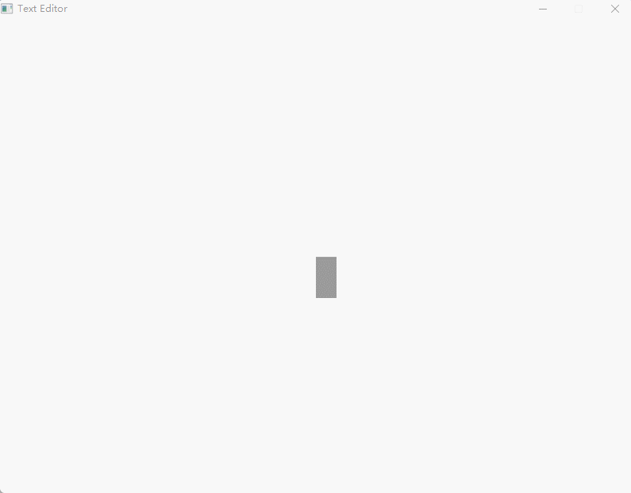

# 一个简单的编辑器，玩具而已

copy from https://www.bilibili.com/video/BV1Nb4y1s7BL?p=1

B站上的这个是网友从Youtube上运过来的，觉得挺有意思，于是基本照敲了下。

原视频中的大哥操作Emacs，感觉真的是太溜，行云流水。膜拜！！

没有想过的是，Editor还可以这样做，文字不是绘制，而是从事先准备好的图片中copy过来，还有，加一个camer，效果实在是挺有意思的。

## 说明
- 只是个玩具而已，看看就好;
- 抄的原视频代码，直接复制了sv文件;
- 在win11下的mingw64编译通过，在实体机opensuse中也可以，需修改下makefile中的`LIBS`;
- 在win下的virtualbox中的debian中尝试时，每按一个字符，好像会收到多个`SDL_TEXTINPUT`事件，界面上也是显示多个相同的字符，不知是什么原因，有人知道的话，可以告知下。
